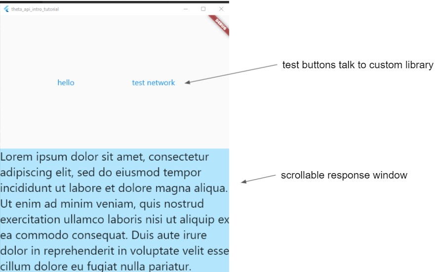

# RICOH API Introduction Tutorial Series

This is the code for a Flutter tutorial series on YouTube.

The code for each tutorial is in a separate branch.

* Lesson 1: Building a custom dart package
* Lesson 2: Using provider for state management

## Lesson 1: Building a Custom Dart Package



Code for tutorial on building a custom Dart package.

The tutorial will be available on May 17, 2021.

https://youtu.be/nGkw3olDmpg

## To Run

Enter the project folder.

Windows desktop

```
flutter create --platforms=windows .
flutter run
```

## Lesson 2: Using Provider for State Management

