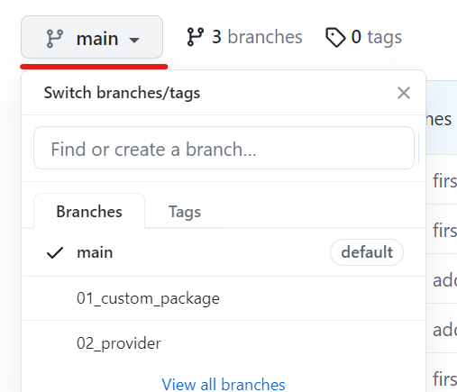
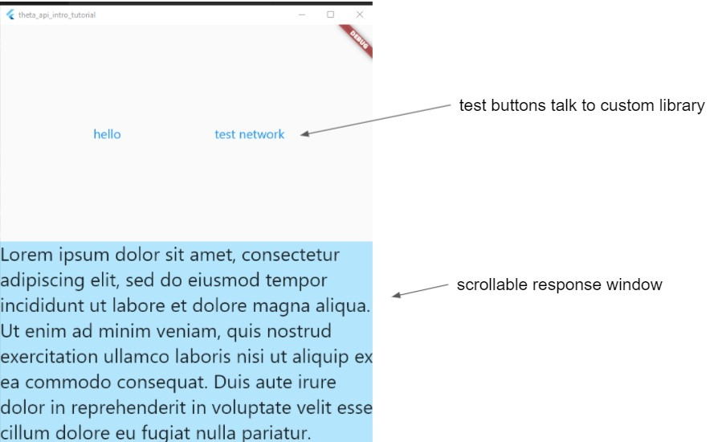
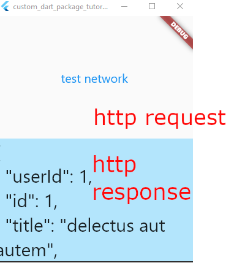
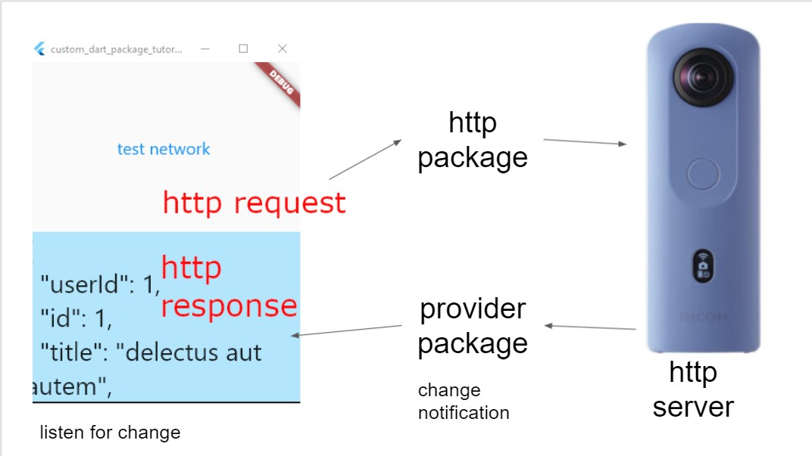

# RICOH API Introduction Tutorial Series

This is the code for a Flutter tutorial series on YouTube.

The code for each tutorial is in a separate branch.

* Lesson 1: Building a custom dart package. [Lesson 1 video](https://youtu.be/nGkw3olDmpg) - Available May 17, 2021
* Lesson 2: Using provider for state management. [Lesson 2 Video on YouTube](https://youtu.be/BqexMSPah4o) - Available May 24, 2021



## To Run

Enter the project folder.

Windows desktop

```
flutter create --platforms=windows .
flutter run
```

## Lesson 1: Building a Custom Dart Package



[Lesson 1 video](https://youtu.be/nGkw3olDmpg)


## Lesson 2: Using Provider for State Management





